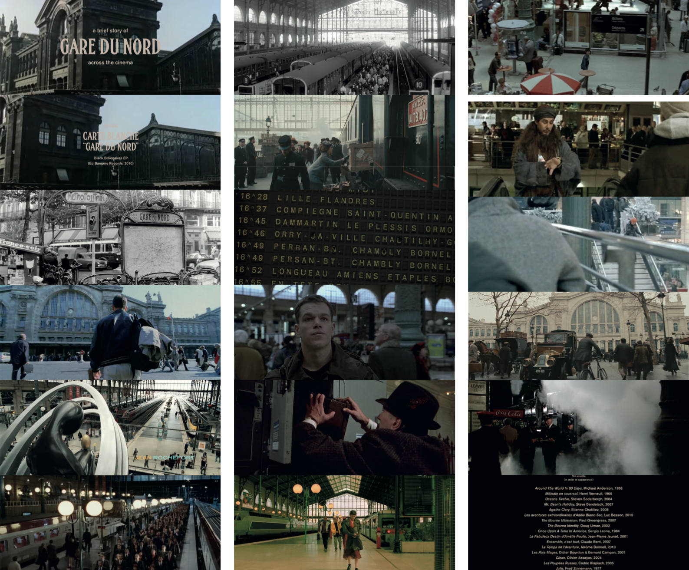

#A brief history of Gare du Nord across the cinema

<small>vidéo, 4'04".</small>

Montage vidéo réalisé à partir d’une sélection de scènes ayant été tournées à la Gare du Nord, extraites de films sortis au cinéma, sur un morceau éponyme du groupe Carte Blanche.

Les époques, les acteurs les cadrages et les styles se confrontent, dialoguent entre eux, reliés en toile de fond par cette gare, immuable et fourmillante, témoin d’inombrables histoires. Entre rencontres et séparations, départs et arrivées, attentes et précipitations.

