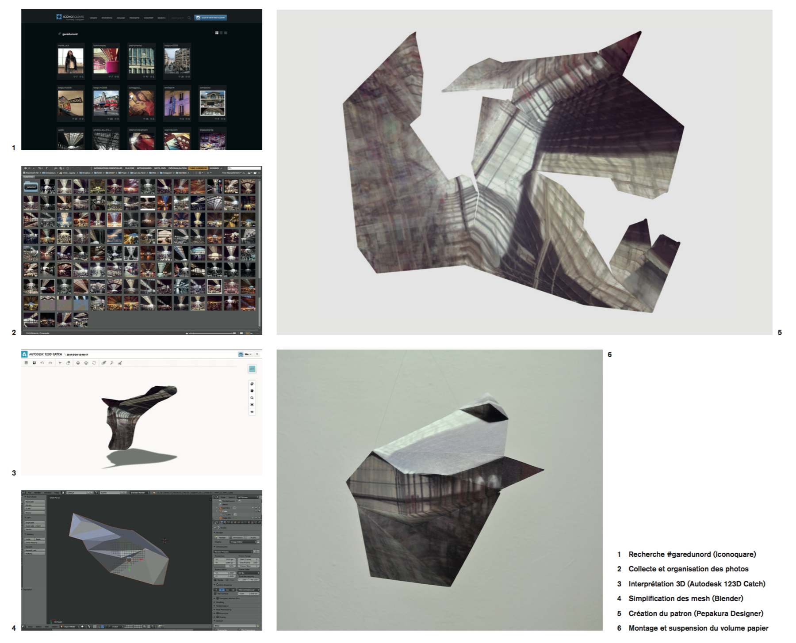

# #garedunord collective space

*3D, pliages en papier, 120 cm3*

En observant les photos taguées #garedunord sur Instagram, on remarque que certains sujets apparaissent plus fréquement que d’autres, dont notamment la facade du bâtiment et la verrière intérieure.

Tout le monde prend les mêmes photos ou presque des mêmes sujets: seuls l’heure de la journée et le filtre Instagram choisi semblent varier. À partir de ce constat, je cherche à reconstruire un espace 3D virtuel en détournant un logiciel prévu pour recomposer un modèle 3D à partir d’une suite de photos à 360° d’un objet.

Des erreurs surgissent alors dans l’interprétation tridimensionnelle du volume, dégageant par là même une certaine poésie : d’une collection de photos publiées en ligne par des individus isolés, émerge un espace hybride collectif, sorte de reflet des flux à la fois humains et numériques générés par ce lieu.

