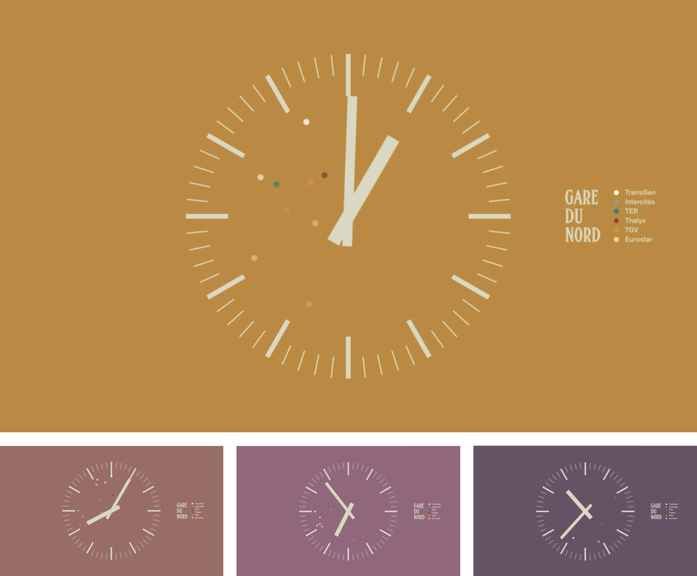

#Gare du Nord – Train Departures’ Symphony 

*<a href="https://vimeo.com/99423480" target="_blank"><small>https://vimeo.com/99423480</small></a>*

À l’aide d’un programme Processing, je récupère les données relatives aux départs des trains en Gare du Nord : horaires, voies, types de train, etc.

Je traduis ensuite ces données sous la forme d’une boucle vidéo de trois minutes (le temps est accéléré 480×) où chaque départ de train est signifié par un point de couleur, associé à un son, selon le type de train qu’il représente.

Émergent alors des motifs sonores et visuels imperceptibles en temps normal, variants en fonction de l’heure de la journée et rendant compte du rythme auquel vit la gare, son personnel et ses usagers.

